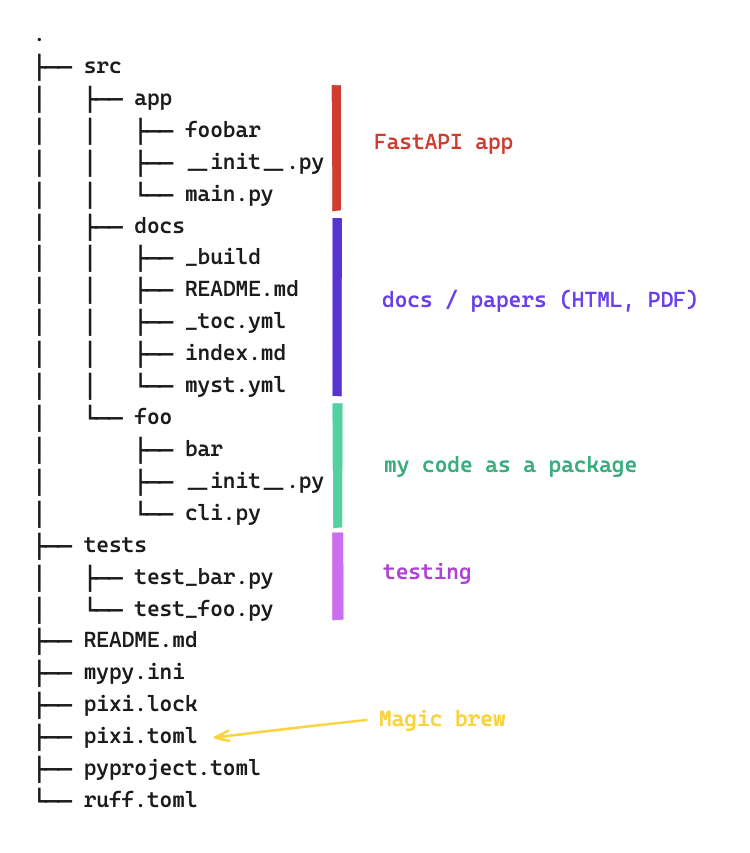

# Eierlegende Wollmilchsau (ELWMS) a.k.a. `pixi`

This is a dummy project with arbitrary structure - the goal is to test the superpowers of `pixi`. In order to build an [editable package](https://setuptools.pypa.io/en/latest/userguide/development_mode.html) it uses the `pyproject.toml` in addition to `pixi`'s own `pixi.toml`. The integration with `pyproject.toml` is WIP.

[pixi.sh](https://pixi.sh/latest/)

> [!IMPORTANT]  
> `pixi` is still in _alpha_ stage



## Get started

1. [install pixi](https://pixi.sh/latest/#installation)
2. clone this repo and `cd` into it

> [!IMPORTANT]  
> I added the all platforms to the `pixi.toml` but only tested for `osx-arm64`.

## Things you can do

### Install `foo` as an editable package

```sh
pixi run postinstall
```

### Run test with `pytest`

```sh
pixi run test
```

### Run linters, formatters, ...

```sh
pixi run lint
pixi run fmt
pixi run mypy
```

### Create HTML docs

```sh
pixi run docs         # HTML in dev-mode
pixi run build-html   # build and serve HTML
```

### Run your `fastapi` application

```sh
pixi run dev         # starts the Uvicorn web server
```
